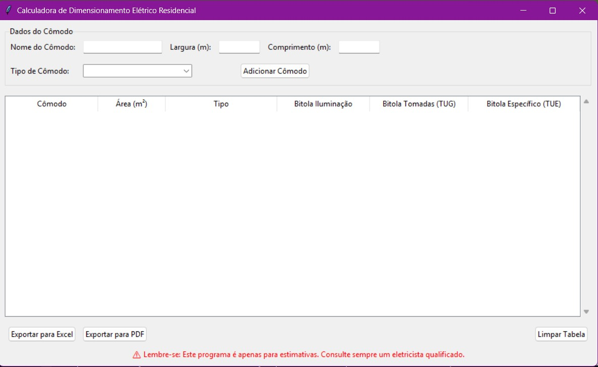

# Interface para Cálculo Elétrico Residencial (Consultar a NBR5410)

## Para o desenvolvimento do software foi utilizada a linguagem Python, pois é necessário efetuar cálculos e exportação dos dados em excel e pdf. Além disso, o script foi gerado pela IA Gemini, até o momento, está na versão beta, tendo em vista que é o projeto piloto.

### Bibliotecas:
- Pandas
- Pandas openpyxl reportlab
- Atualizar o pip

### Versão:
Python 3.13.5

### Observações
Recomendado criar ambiente virtual para produção com o comando "python -m venv nome_do_ambiente_virtual", com isso, tudo ficará compactado e funcional, além de ficar completo para a conversão do arquivo em executável com a lib "pip install pyinstaller" e criando com "pyinstaller --onefile seu_script.py". Após criá-lo, o Windows dará um falso positivo para malware, porém, esse alerta é devido a execução do win32 (instalar com "pip install pywin32"), em segundo plano.
